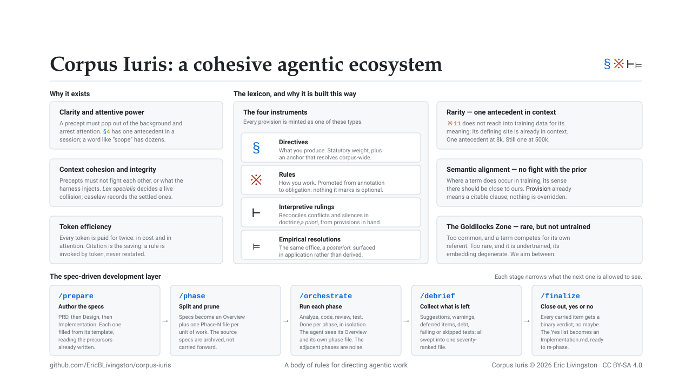

#  Corpus Iuris

[Presentation deck](https://ericblivingston.github.io/corpus-iuris/docs/deck/index.html)

This repository contains my own "Body of Rules" for directing agentic work. The base is harness-neutral, Claude Code is the harness I run it on, and `adopting.md` and the `transforms/` packages carry it to others (e.g. Codex, Gemini, Grok). It is highly opinionated; it represents how I think of, design, and build code, and is expected to be more of a structural model and example of how you might implement a similar set of precepts.

## What it actually is

It's a set of Spec-Driven Development (SDD) provisions, rules, caselaw, and supporting content that helps direct how a model proceeds with creating content, whether it be markdown files or source code. The main goals of this system are:

1. Clarity and Attentive Power - We want our rules to "pop out" from the background context and arrest a model's attention, helping to increase the likelihood of them being abided by.

2. Context cohesion and logical integrity - We want our rules to not conflict or create ambiguity, especially when read along with other rules of our own making or those injected automatically by a harness's system prompt or other sources of direction.

3. Token Efficiency - We need to balance long-winded exposition and use cases with brevity, acknowledging that we pay for every token here in both real cost and in attention span. Less is More when doing context engineering.

To achieve those goals, we introduce a lexicon of symbols and terms chosen specifically for the job, and we use structure in the form of a taxonomy and namespaces.

## Why all the Latin and odd symbols and terms?

We're not trying to be pretentious or pedantic. We select for two properties, and both do the same job: minimizing competition for the referent. There are two main ways this can go wrong.

### Rarity: one antecedent in context

A token like `※11` is not reaching into training data for its meaning. Its definition is already in context, loaded at session start, and the token's whole job is to be a bright, unambiguous path back to that defining site.

That resolution is a mechanical operation. The model scans the context for previous occurrences of the current token and attends to what followed them — prefix matching, the induction-head circuit. It matches on the exact token, and its precision degrades as that token accumulates prior occurrences pulling toward different continuations.

So we seek terms and symbols that are:

1. **Rare in our own authored artifacts** — documentation, source, prose, commit messages — so nothing in the working context competes to be the match.
2. **Rare in ordinary technical usage** — so nothing the harness injects, and no training data, competes either.

`※11` has one antecedent in a session: its provision. A word like "rule" or "scope" has dozens, each pulling somewhere else.

That count is what has to survive scale. Attention is a fixed budget, and softmax spreads it thinner across everything present as a window fills; accuracy falls with context length on its own. Nor does irrelevant material sit inertly beside the signal — it competes with it. Retrieval that can lean on a literal token match holds up under that pressure, while retrieval working by resemblance degrades sharply as the haystack grows.

`※11` has one antecedent at 8k and one at 500k. The count does not grow with the window, so the path back to the ius stays as bright at the top of the range as at the bottom. "Scope" has thirty antecedents at 8k and thousands at 500k, and is lost in exactly the sea of context we are trying to stay out of.

### Semantic alignment: no fight with the prior

Where a term *does* occur in training data, its sense there should be close to ours.

This is not an attempt to make a model reason like a lawyer. The goal is negative: a term whose trained default contradicts our stipulated use sets what the context says against what the weights expect, and that conflict resolves unreliably. Operating against a trained default is also expensive; the same task gets worse when familiar terms are given unfamiliar meanings.

The win is avoiding that fight rather than winning it. Where the prior already agrees, term fidelity comes free: `provision` means a discrete citable clause in ordinary legal use, so nothing has to be overridden.

### The band

The two properties help from opposite ends. A term too common competes for its own referent. However, a token too rare is *undertrained*: vocabulary entries a model has barely seen carry degenerate embeddings and behave erratically. This is why we don't just make up nonsense words. We want a term that is rare enough to be unambiguous, but not so rare that it is untrained.

Here's the ladder we're climbing:

1. **No rules at all: ad hoc** - "When writing this, make sure not to introduce functions and things we don't need right now. Keep it to just what we discussed and no more" (and variations repeated time and time again)

2. **Rule defined in general terms** - "When writing this, remember our Rule about going out of scope"

3. **Precept defined rigorously** - "Abide by §2" (often not needed, but sometimes worth reinforcement)

Below is a table of our terms and symbols, and what each was chosen for.

| Term / Symbol | Typical Definition | How we leverage that in our own usage |
| ---- | ---- | ---- |
| **Ius** | Roman law: law as a body of right (*ius civile*), as against *lex*, the single enacted statute. | Names the body itself, so no one rule can be mistaken for the whole. |
| **Corpus** | In scholarly publishing, the live collection, with withdrawn and archived material excluded by definition; in ML, a curated dataset, where membership follows from active inclusion rather than mere availability. | Membership by inclusion, not by presence on disk: what no loader, invoker, or live reference reaches is dead code, and dead code is not corpus. |
| **Adventitia** | Latin: "externally added"; Descartes' *ideae adventitiae*, ideas arriving from outside the mind — neither innate nor self-made. | Marks content the harness supplies that no source edit can reach — a claim about provenance, not authority. |
| **Precept** | A rule of conduct laid down by an authority. | The umbrella for everything that binds, whichever instrument minted it. |
| **Canon** | The closed, admitted set of texts constituting a body — always read, as against material that may be read but is not guaranteed. | Admission by guaranteed presence, so a citation always resolves in context; what lies outside is deuterocanonical, and binds once read. |
| **Provision** | A clause of a statute or contract: a discrete, citable term. | Gives every rule an address, so it can be cited from anywhere instead of quoted. |
| **Doctrine** | Legal doctrine: the systematized principles of a field, accreted through commentary and experience rather than enacted a priori. | Signals that nothing here was reasoned out in advance — each provision represents an a posteriori remediation. |
| **Rubric** | Liturgical rubric: the red-letter directions governing how the rite is performed, as against the words of the rite. | Separates procedure from the precepts it carries out: rubric instructs without minting anything citable. |
| **Caselaw** | Judge-made law: rules established in deciding cases, binding later ones through *stare decisis*. | A collision between provisions is decided once, and the holding binds every later reading. |
| **Instrument** | Legal instrument: the vehicle creating or recording an obligation; a *statutory instrument* is a whole class of enactment. | Names which of the four vehicles minted a provision — the first position in every token. |
| **Ambit** | The scope or reach of a rule — "within the ambit of the statute". | The reach position in a token: universal, one installation, one project, or one agent. |
| **Lingua** | Latin: tongue, a language as such. | Scopes a provision to a language by membership, so `cc` reaches `.cc`, `.cpp`, and `.h` alike. |
| ***Lex specialis*** | *Lex specialis derogat legi generali* — the specific rule displaces the general one. | Adopted intact as the precedence rule; the ambit ladder supplies the ranking it needs. |
| **Peritus** | Later civil and canon law: the expert a tribunal engages for an opinion it cannot reach itself. | *Culpa in eligendo* — engaged for peritia this session lacks. |
| `§` | Section sign (silcrow): marks a numbered section or clause of a statute, contract, or treatise. | Statutory weight, plus an address: `§4` resolves corpus-wide, never to nearby prose. |
| `※` | Kome / reference mark: in Japanese and Chinese typography, prefixes a note the reader must not miss. | Rare enough to arrest attention, and promoted from annotation to obligation — nothing it prefixes is optional. |
| `⊢` `⊨` | Turnstiles: `Γ ⊢ φ`, "φ is derivable from Γ"; `M ⊨ φ`, "φ holds in model M". | The distinction carries over intact: `⊢` is derivable a priori from the provisions in hand, `⊨` needs a posteriori experience to show it. |

Most of this vocabulary never leaves the ius. In ordinary use only the symbols surface, plus the occasional category name — "scan for doctrine violations" — while the rest works internally, resolving context rather than being recited.

## The Spec-Driven Development Layer

Spec-Driven Development in our corpus runs as three commands. `prepare.md` authors the specs in order, PRD then Design then Implementation. `phase.md` converts them into an Overview carrying what more than one phase needs, plus one `Phase-N.md` per unit of work. `orchestrate.md` executes those phases, and an executing phase is handed its Overview and its own phase file and nothing else:

> Read only `Overview.md` and the `Phase-X.md` files — the whole specification this run executes against. The specs those phase files superseded are archived and closed to this run.

We aggressively narrow the context of each coding agent, seeking to focus it on just the work at hand, and to avoid distraction from the adjacent phases. Distraction is worst when the irrelevant material most resembles the relevant: accuracy falls, and reasoning effort rises, as the similarity between a distractor and the question increases. Phase 2's content is close to the worst possible distractor for Phase 3: same project, same vocabulary, same file paths, adjacent intent, yet no longer relevant.

A second reason is independent of content: length alone degrades performance, so dropping even harmless material pays.

Pruning at the outset is only half of it, because an orchestrator that reads what it dispatches re-accumulates everything the split was meant to prevent. So the orchestrating session never reads source, analysis, review, or test output. Specialists write to files and return one line; the orchestrator passes paths rather than content. The window stays small by construction rather than by discipline at the start.

## References

| Claim | Work |
| ---- | ---- |
| A model resolves a repeated token by matching its earlier occurrence and attending to what followed — the mechanism a citation rides on. | [In-context Learning and Induction Heads](https://arxiv.org/abs/2209.11895); [Induction Heads as an Essential Mechanism for Pattern Matching in In-context Learning](https://arxiv.org/abs/2407.07011) |
| Models bind a token to its referent in context through dedicated internal structure. | [How do Language Models Bind Entities in Context?](https://arxiv.org/abs/2310.17191) |
| Attention is a finite budget that softmax dilutes as context grows, and length alone degrades performance. | [Long Context, Less Focus: A Scaling Gap in LLMs](https://arxiv.org/abs/2602.15028); [Context Length Alone Hurts LLM Performance](https://arxiv.org/abs/2510.05381) |
| Irrelevant context competes with the signal rather than sitting beside it, measurably lowering accuracy. | [Large Language Models Can Be Easily Distracted by Irrelevant Context](https://arxiv.org/abs/2302.00093) |
| Distraction scales with resemblance: the closer irrelevant material sits to the question, the worse it hurts — which is what makes the adjacent phase the cut worth making. | [How Reasoning Models Fail with Contextual Distractors](https://arxiv.org/abs/2601.07226); [The Distracting Effect: Understanding Irrelevant Passages](https://arxiv.org/abs/2505.06914); [How Easily do Irrelevant Inputs Skew the Responses of LLMs](https://arxiv.org/abs/2404.03302) |
| Long-context retrieval leans heavily on literal token overlap, and degrades sharply without it. | [NoLiMa: Long-Context Evaluation Beyond Literal Matching](https://arxiv.org/abs/2502.05167) |
| Context and the parametric prior conflict, and which one wins is not reliably predictable. | [Knowledge Conflicts for LLMs: A Survey](https://arxiv.org/abs/2403.08319) |
| Operating a term against its trained default carries a measured performance cost. | [Reasoning or Reciting?](https://arxiv.org/abs/2307.02477) |
| Tokens too rare in training are undertrained, with degenerate embeddings and erratic behaviour. | [Fishing for Magikarp](https://arxiv.org/abs/2405.05417) |

## Versioning

Releases are tagged `MAJOR.MINOR.PATCH`, and relate to whether a keyed overlay you wrote against a provision still means what you meant by it. **MAJOR** says a token was renumbered, retired, or had its holding changed. **MINOR** says a token was added and nothing existing moved; **PATCH** is prose, examples and corrections, changing no holding.

## Prerequisites

The corpus needs nothing but a harness that will load Markdown into a session's context. Parts of the corpus do refer to the following tools, but will quiesce if they are not present.

`※md1` names a Markdown linter and `⊨1` names a symbolic toolserver, and neither provision says which one: [`adopting.md`](adopting.md) is where filling those slots is covered. My installation (and the examples) assume the following are present:

- **[rumdl](https://github.com/rvben/rumdl)** fills `※md1` — a Markdown linter offering the check and fix modes the provision asks for: `rumdl check <path>` and `rumdl fmt <path>`. Install with `pip install rumdl` or `cargo install rumdl`.
- **[Serena](https://github.com/oraios/serena)** fills `⊨1` — a language-server-backed symbolic toolserver, which is what lets a model find and edit a symbol rather than read a file to reach it.

The rest are conditional on which published parts you take:

| Part | Assumes |
| ---- | ---- |
| `skills/using-gemini/` | The Gemini CLI (agy). The skill is used to drive that CLI. |
| `skills/using-codex/` | The Codex CLI (codex). The skill is used to drive that CLI. |
| `transforms/codex/` | Codex, and Python 3.10 or newer for the session-start loader. |

## License

One licence, **CC BY-SA 4.0** (`LICENSE`), covers the provisions, rules, caselaw, commands, agents and templates, the Python under `transforms/`, and every other file here.

Proper attribution of the work here is:

> Corpus Iuris © 2026 Eric Livingston, licensed under [CC BY-SA 4.0](https://creativecommons.org/licenses/by-sa/4.0/).

ShareAlike is not a restriction on commercial use, but it does prohibit taking the corpus, passing it off as someone else's, and selling it closed.

The obligation attaches to Sharing a derivative, not to using one, and Sharing means putting it in front of the public: publishing it, distributing it, displaying it, making it available for anyone to fetch. Adopt the corpus inside your organisation — key over the provisions that do not fit, mint what is missing, run it against your own code — and ShareAlike is never reached. Work kept within the one entity generally does not get there; handing a derivative to contractors, affiliates or clients may; pointing them to the repo is the better method.

Two adopted texts keep their own terms: the Creative Commons legal code in `LICENSE`, which Creative Commons dedicates under CC0 and asks that it not be modified, and `CODE_OF_CONDUCT.md`, the Contributor Covenant 2.1 under CC BY 4.0, whose attribution footer travels with it.
