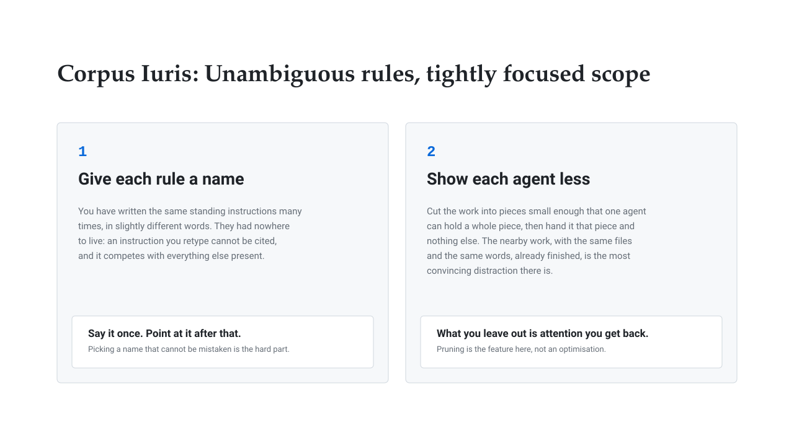
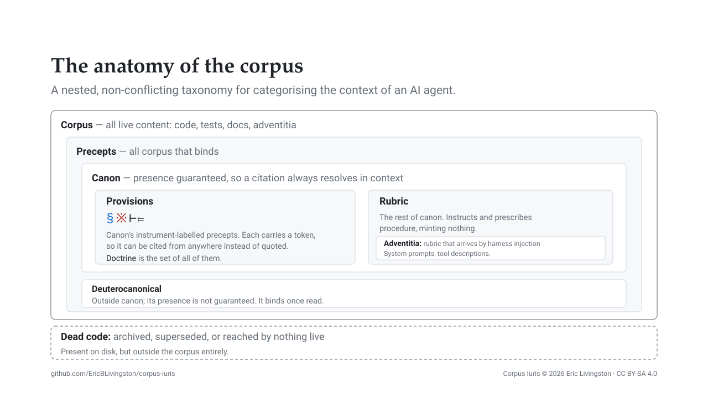
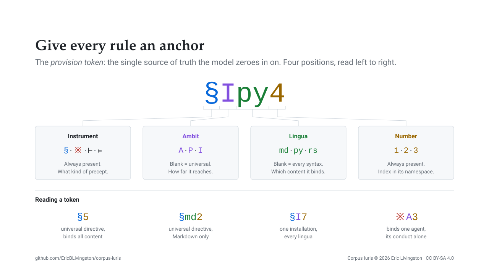
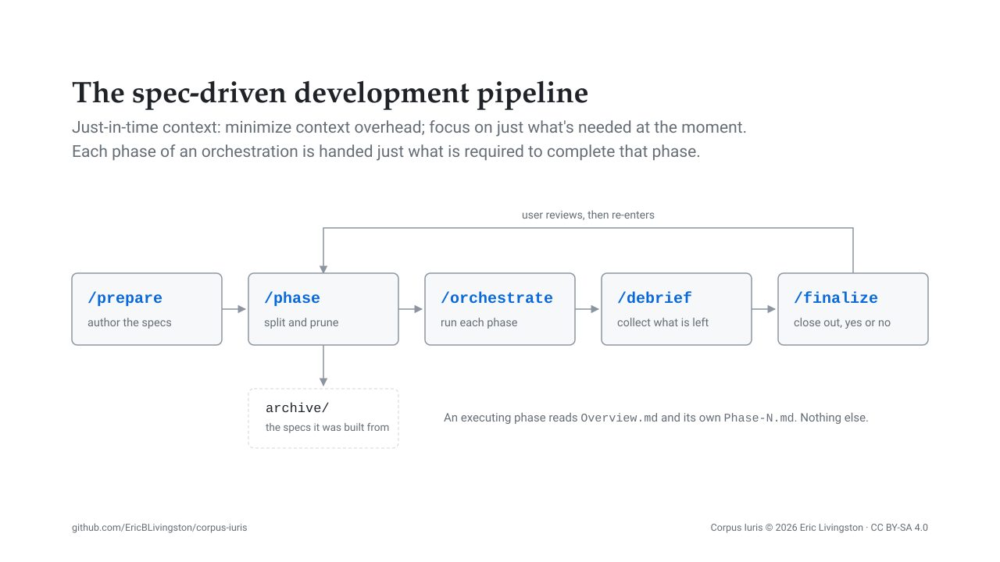
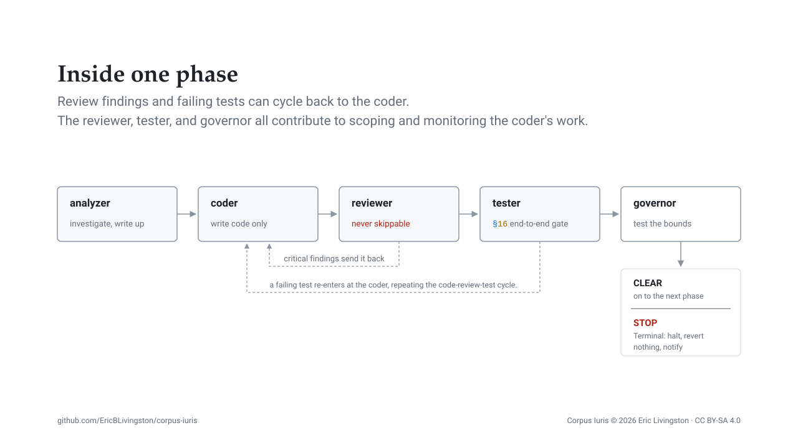
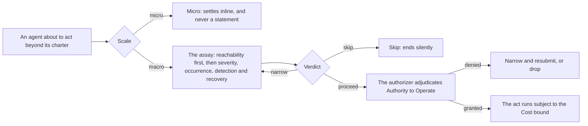

#  Corpus Iuris

This repository contains my own "Body of Rules" for directing agentic work, in three parts: a lexicon and a structure that let a rule be cited rather than restated, a Spec-Driven Development pipeline that turns a request into phased work, and a production chain that executes one phase under a governance apparatus holding every act to limits written before the work began. The base is harness-neutral, Claude Code is the harness I run it on, and [`adopting.md`](adopting.md) and the `transforms/` packages carry it to others: a package ships for Codex and one for Grok. It is highly opinionated; it represents how I think of, design, and build code, and is expected to be more of a structural model and example of how you might implement a similar set of precepts.

## What the corpus is

A set of provisions, rules and caselaw directing how a model proceeds with creating content, whether that content is Markdown or source code, plus the commands, agents and templates that put them to work. Spec-Driven Development is one aspect of that: the directives, rules and caselaw bind every session whatever it is doing, and the pipeline, the chain and its governance decide how one piece of work is shaped, executed and bounded.

The main goals of the system are:

1. **Clarity and attentive power** — We want our rules to "pop out" from the background context and arrest a model's attention, helping to increase the likelihood of them being abided by.
2. **Context cohesion and logical integrity** — We want our rules to not conflict or create ambiguity, especially when read along with other rules of our own making or those injected automatically by a harness's system prompt or other sources of direction.
3. **Token efficiency** — We need to balance long-winded exposition and use cases with brevity, acknowledging that we pay for every token here in both real cost and in attention span. Less is more in context engineering.
4. **Governance and accountability** — Every action taken within the system is subject to pre-established rules and oversight, ensuring that work is conducted within defined limits and responsibilities are clear.
5. **Specification-driven and traceable** — Every piece of work is guided by a clear specification, and its execution is traceable back to the governing rules and directives, ensuring accountability and reproducibility.

## Entry points

[The presentation deck](https://ericblivingston.github.io/corpus-iuris/docs/deck/index.html) walks the whole system for a general developer audience.

[`adopting.md`](adopting.md), for taking any of this into an installation of your own: write your instance file first, key over what does not fit, and never renumber to close a gap. [`installing.md`](installing.md), for where the files then go: the clone, the staging copy and production as three separate surfaces, and the destination for each published piece. [`docs/`](docs/README.md) holds the detail pages and the diagrams.

## Why all the Latin and the odd symbols

We select for two properties, both minimizing competition for the referent:

1. **Rarity**. A token like `※11` is not reaching into training data for its meaning; its definition is already in context, and the token's whole job is to be a bright path back to that defining site. Resolution is mechanical, matching the exact token and attending to what followed its earlier occurrences, so precision degrades as a token accumulates occurrences pulling toward different continuations. `※11` has one antecedent in a session, at 500k as surely as at 8k; "scope" has dozens, and hundreds once the window is full.

2. **Semantic alignment**. Where a term does occur in training data, its sense there should be close to ours: a trained default contradicting our stipulated use sets the context against the weights, and that conflict resolves unreliably.

[The lexicon page](docs/lexicon.md) further explains both properties, and a table of terms and symbols with what each one was chosen to bring with it.

## Provision tokens

A *token* (a special kind of label or prefix) comprises four elements, and two of them are meaningful when blank. `§5` binds every installation and every kind of content; `§md2` binds Markdown alone; `§Ipy4` binds one installation's Python; `※A3` is one agent's rule about its own conduct. Reach is a ladder, universal to instance to project to agent, and a collision is settled by *lex specialis*: the more specific governs, with the user's live instruction above all of it.

[The structure page](docs/structure.md) takes each in turn: the four instruments, the token's four positions and what a blank one means, the ambit ladder and why an instance overlay outranks the universal ambit, the precedence order and where adventitia falls within it, and the silent failure that follows from renumbering a global token.

## From a request to phased work

`prepare`, `phase`, `orchestrate`, `debrief` and `finalize` comprise the development lifecycle. `prepare` authors the specs in order, PRD then Design then Implementation. `phase` converts them into an Overview carrying what more than one phase needs plus one `Phase-N.md` per unit of work. `orchestrate` executes the phases; `debrief` sweeps what the run left open, and `finalize` forces each open item to a binary Yes or No, which closes the cycle into a loop, as the close-out plan can re-enter at `phase`.

`implement` is the unphased alternative to `orchestrate`, and `optimize` is a pruning pass over a single document. Only `orchestrate` and `implement` reach code, and neither writes any itself.

[The pipeline page](docs/pipeline.md) takes each command in turn, and covers the context discipline the whole shape exists for: an executing phase is handed its Overview and its own phase file and nothing else, because the adjacent phase is close to the worst distractor available (same project, same vocabulary, same paths, no longer relevant).

## Inside one phase

Four specialists run in a fixed order: the analyzer establishes scope, the coder makes the change, the reviewer passes or fails the work against the specification, and the tester runs only once review has passed. Steps two and three are a loop; a test failure re-enters at step two, and both loops cap at three iterations by default, after which the residue surfaces to the user for manual intervention.

[The execution page](docs/execution.md) carries the roster and what each role is barred from, where the loops re-enter, and the fifth stage `orchestrate` adds after the tester.

## Bounds: keeping the work in scope

An agent that can widen its own remit has no remit, so the corpus makes moving a limit an explicit, refereed act. A bound is a limit on produced content, written by the party scoping the work and fixed before the first edit. The governor tests produced work against that set and reports violations, stopping further progress.

Anything that would put more work under a charter than the charter granted is *ultra vires*, whether it is a dispatch nobody asked for or an amendment to a bound the work cannot land inside. Neither is forbidden, and neither is self-authorized: where the assay lands on proceed, the agent submits a request, which an Authorizing Official grants or denies.

[The governance page](docs/governance.md) goes into more detail: where a bound comes from, the seven filters a candidate clears before it becomes one, the governor's inverted charter served twice on the same dispatch shape, the statement of assumed risk row by row, and the refutation standard the Official assesses it against.

## The repository layout

| Path | Holds |
| ---- | ---- |
| `rules/` | The precepts themselves: the specification of the instruments and their ambits, the directives, the rules, the caselaw, the peritus engagement protocol, and the language namespaces |
| `reference/` | What loads on demand: the case history behind each ruling, the language principles, the plan, debrief and orchestration templates, and the statement of assumed risk |
| `agents/` | One definition each: the chain's specialists, the two the governance apparatus dispatches, and support roles |
| `commands/` | The Spec-Driven Development commands, `prepare` through `finalize`, plus `implement` and `optimize` |
| `skills/` | The dispatch cards: the production chain and codebase analysis, governing work and the risk assay, and one per peritus command-line program |
| `transforms/` | Instructions and guidance on implementing the corpus ius under different Agents (e.g. Codex) |
| `docs/` | The deck, the diagrams, and the detail pages linked above |
| `adopting.md` | General instructions on implementing the corpus locally, one provision at a time |
| `installing.md` | Where each published piece goes and how it gets there: the three surfaces, the staging loop, and what makes an artifact resident on each harness |
| `instance-example.md` | The base instance file to copy and refactor: the refinements table, the ⊢3 register, and the placeholders every installation resolves |

## References

Every empirical claim above rests on published work, listed on [the references page](docs/references.md).

## Versioning

Releases are tagged `MAJOR.MINOR.PATCH`, and relate to whether a keyed overlay you wrote against a provision still means what you meant by it. **MAJOR** says a token was renumbered, retired, or had its holding changed. **MINOR** says a token was added and nothing existing moved; **PATCH** is prose, examples and corrections, changing no holding.

## Prerequisites

The lexicon and the structure need nothing but a harness that will load Markdown into a session's context. The other two layers require the ability to dispatch: every file under `agents/` is a definition for a harness that dispatches subagents by agent type.

Where a tool the corpus refers to is absent, the intent is that the part depending on it degrades rather than fails. That is design intent rather than a gated property: `commands/orchestrate.md` carries an actual guard and skips its fact-check when the auditing skill is absent, and `agents/knowledge.md` states its own degraded mode in prose, but nothing checks either.

`※md1` names a Markdown linter and `⊨1` names a symbolic toolserver, and neither provision says which one: [`adopting.md`](adopting.md) is where filling those slots is covered. My installation (and the examples) assume the following are present:

- **[rumdl](https://github.com/rvben/rumdl)** fills `※md1`, a Markdown linter offering the check and fix modes the provision asks for: `rumdl check <path>` and `rumdl check --fix <path>`. Install with `pip install rumdl` or `cargo install rumdl`.
- **[Serena](https://github.com/oraios/serena)** fills `⊨1`, a language-server-backed symbolic toolserver, which is what lets a model find and edit a symbol rather than read a file to reach it.

The rest are conditional on which published parts you take:

| Part | Assumes |
| ---- | ---- |
| `skills/using-gemini/` | The Gemini CLI (agy). The skill drives that CLI |
| `skills/using-codex/` | The Codex CLI (codex). The skill drives that CLI |
| `skills/using-pi/` | pi, a model-agnostic CLI driving OpenRouter models |
| `transforms/codex/` | Codex, and Python 3.10 or newer for the session-start loader |
| `transforms/grok/` | Grok, which discovers the agent and command artifacts the package carries |
| `agents/*.md`, and every command dispatching one | A harness that dispatches subagents by agent type |
| `commands/phase.md` | A way to move files into a new directory, for the sweep into `plans/<plan>/archive/`, and a text search for the convergence test it runs per identifier |
| `commands/orchestrate.md` | git and a shell. Its closing fact-check wants an auditing skill that is not yet published; the command guards that and skips to the summary |
| `commands/finalize.md` | A POSIX shell: `mkdir`, `mv`, and the grep behind the verdict-language check |
| `agents/knowledge.md` | Nothing. A durable knowledge store is an upgrade rather than a dependency, and is not distributed; without one, the agent's own prose makes the project memory file the whole of persistent memory and the curation doctrine applies to it unchanged |

Gemini, Codex and pi are periti in the default installation, engaged one question at a time through their own command-line programs, and each is optional on its own. Codex and Grok are also harnesses, and the `transforms/` packages are what carry the corpus onto them.

## License

One license, **CC BY-SA 4.0** (`LICENSE`), covers the provisions, rules, caselaw, commands, agents and templates, the Python under `transforms/`, and every other file here.

Proper attribution of the work here is:

> Corpus Iuris © 2026 Eric Livingston, licensed under [CC BY-SA 4.0](https://creativecommons.org/licenses/by-sa/4.0/).

ShareAlike is not a restriction on commercial use, but it does prohibit taking the corpus, passing it off as someone else's, and selling it closed.

The obligation attaches to Sharing a derivative, not to using one, and Sharing means putting it in front of the public: publishing it, distributing it, displaying it, making it available for anyone to fetch. Adopt the corpus inside your organization (key over the provisions that do not fit, mint what is missing, run it against your own code) and ShareAlike is never reached. Work kept within the one entity generally does not get there; handing a derivative to contractors, affiliates or clients may; pointing them to the repo is the better method.

Two adopted texts keep their own terms: the Creative Commons legal code in `LICENSE`, which Creative Commons dedicates under CC0 and asks that it not be modified, and `CODE_OF_CONDUCT.md`, the Contributor Covenant 2.1 under CC BY 4.0, whose attribution footer travels with it.
