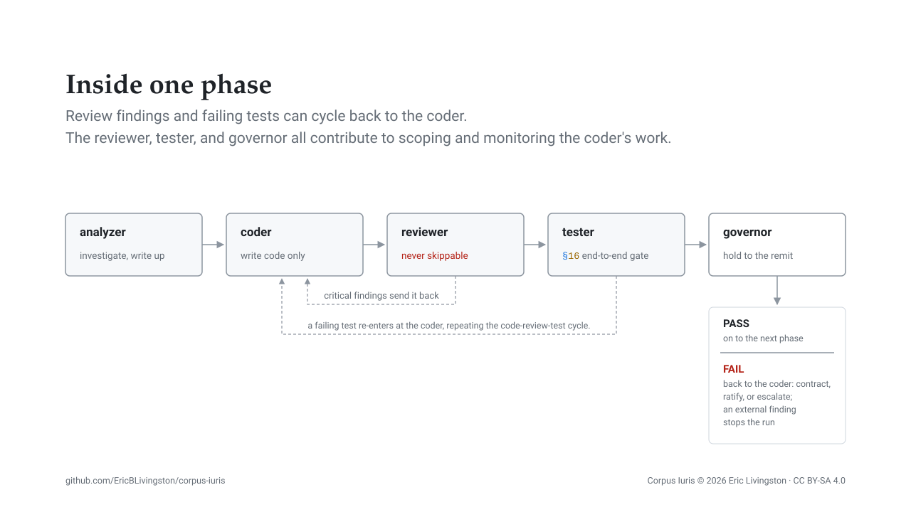

# Execution: inside one phase

The [pipeline](pipeline.md) produces a folder of phases. This page sets out what happens inside one of them: four specialists in a fixed order, two loops that re-enter it, and a gate at the end that holds the produced work to the remit the plan files state.

## The chain

`※8` orders four steps and makes review never skippable, and `skills/writing-code/SKILL.md` drives them:

1. **Analyze.** The analyzer establishes scope: affected files, dependencies, risks, the recommended approach. Understanding that spans two or more files lands here, as does refactor and migration planning, a duplication hunt, and anything phrased "across the codebase".
2. **Implement.** The coder makes the changes.
3. **Review.** The reviewer returns findings ranked critical, important, nice-to-have.
4. **Test.** The tester runs only once review has passed.

Each step's output is the next step's input: the analysis to the coder, the implementation summary to the reviewer, the review to the tester. Review and test never run in parallel, because the reviewer's verdict is an input the tester should be holding.

The chain scales to the work rather than the reverse. Where the content is smaller than the round trip that would move it, analysis and testing fall away and the coding happens in the session that asked for it, with the review dispatched under a bounded charter. What does not scale away is the review: an independent pass over a change is the one stage sizing never removes, including for a non-code refactor.

## The roster

Each row is one definition file under `agents/`, and the charter column paraphrases what that file states for itself.

| Agent | Charter in one sentence | Barred from |
| ---- | ---- | ---- |
| analyzer | Investigates code or text at scale and reports what it finds, including as the author of prose and Markdown artifacts. | Writing code |
| coder | Writes and modifies source to the project's existing conventions. | Reviewing or testing its own work, or dispatching anything to do so save an authorization; running git |
| reviewer | Reviews an already-written change and ranks what it finds. | Editing |
| tester | Writes tests, runs suites, and decides whether a failure is a code defect or a test defect. | Editing the code under test; refactoring project code to make a test pass |
| governor | Judges whether all the work a phase's reports record was necessary to the task the plan files set, from those files and the four reports alone, taken at face value. | Reading anything it was not handed, running any command, judging quality, test outcomes or wording, or dispatching at all |
| authorizer | Assesses a draft statement of assumed risk as Authorizing Official and records the decision. | Performing or redesigning the proposed act, acting as a stage of this chain, or dispatching at all |
| auditor | Answers whether the work reported matches the work performed, and whether the work performed abides every precept binding it. | Reading anything in the work's folder beyond what it was handed, what that cites, and the work's record; writing anything but its report and scratch |
| knowledge | Writes and curates persistent memory. | Writing without the scope-aware duplicate search that precedes every write, or duplicating an entry rather than updating the one already there |

The governor, the authorizer, the auditor and the knowledge agent are not chain stages. The governor and the authorizer belong to [the governance apparatus](governance.md), and both are barred from dispatching because a referee that can dispatch the work it referees is not a referee. The auditor runs in the background once a phase's adjudication passes, and halts nothing. The knowledge agent belongs to neither chain nor apparatus: `※6` routes every memory write to it, and searching needs no agent.

## Periti, and which specialists engage them

A peritus is an external model engaged through a command-line program for reach or a second judgment, one question at a time. It inherits no session and remembers no prior call, so the prompt is the whole of the engagement, and the responsum is weighed against the artifact it claims rather than against its exit status.

Delegation to a peritus is not the re-delegation the two-file rule bars, so the analyzer, coder and reviewer all engage them directly. The coder's use is the narrowest, and narrow by rule: mechanical transformation across two or more files, reaching no architecture decision and no judgment call. Confirming that the peritus changed the files it was asked to, and that the suite still passes, is not the coder reviewing its own work.

## Where the loops re-enter

Implement and review are a loop: the coder is re-invoked on the review's findings, and the change is re-reviewed, until review passes. A test failure re-enters at the coder, and the review loop runs again before the tester does.

## The fifth stage: adjudicate

`orchestrate` adds a stage the chain itself does not carry. After the tester, the governor is handed the remit (the Overview and the phase file) and the four reports the phase just produced.

The return routes three ways, the orchestrator deciding whether to halt:

- `PASS` dispatches the phase's audit in the background, then continues to the next phase.
- `FAIL` with only `beyond` findings sends the coder back to contract the work, ratify it under authorization or escalate, and review, test and adjudication then run again.
- `FAIL` with an `external` finding enters the Terminal.

## Related pages

- [The pipeline](pipeline.md): what produces the phases this chain executes.
- [Governance](governance.md): the remit the adjudication holds the work to, and the path an expansion takes to be ratified.
