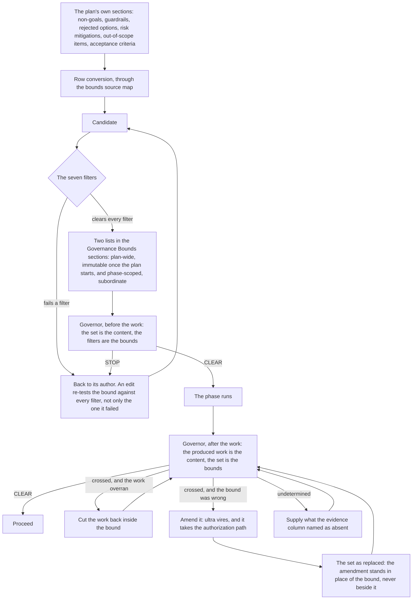
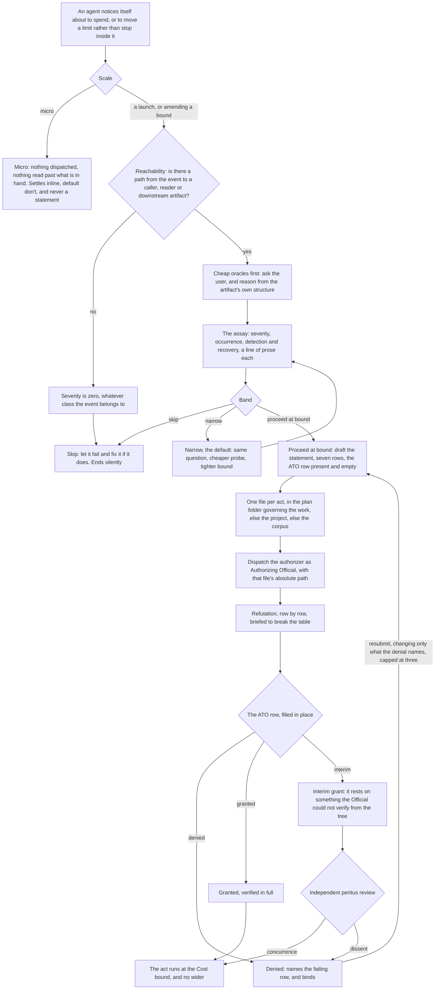

# Governance: what the work may not do

The [pipeline](pipeline.md) decides what the work is. The [chain](execution.md) does it. Governance decides what the work may not do, and it exists because an agent that can widen its own remit has no remit. It relies on bound sets written before the work starts, a governor that tests produced work against that set, an assay any agent runs on itself the moment it notices itself about to spend, and an Authorizing Official who is the only party that can say yes.

The files that govern it are `skills/governing-work/SKILL.md`, `skills/performing-fmea/SKILL.md` with its two protocol files (`fmea-request.md` for the party weighing an act, `fmea-assessment.md` for the party deciding on it), the forms they fill at `reference/templates/plan/bounds-sources.md` and `reference/templates/fmea-statement.md`, and the two role definitions `agents/governor.md` and `agents/authorizer.md`.

`※12` is the rule routing every act into it, on one principle: no party authorizes its own ultra vires work.

Note: This may seem overly complex or heavy-weight. It has been evolved through empirical testing and a posteriori analysis of many instances of extreme agent overruns; many hours and billions of tokens spent on unauthorized work that grossly exceeded any charter or initial remit. This is among the most dangerous and impactful failure modes in autonomous agent systems. Thus, we spend a significant amount of effort on governance to prevent such occurrences.

## What counts as ultra vires

*Ultra vires* (*lit.* *beyond the powers*) is the public-law sense, and it turns on *charter*, the grant a piece of work runs under; [the lexicon](lexicon.md) carries both terms and `rules/ius.md` defines them. An act is ultra vires when it would put more work under that charter than the charter granted. The term describes the act rather than its merit, so a perfectly sensible act can be ultra vires; it's one reason we use this precise term.

It takes one of two shapes:

- **A launch**: a dispatch, or a sweep past what is already in hand, that the charter does not grant.
- **Amending a bound** the asked-for work cannot land inside, which moves a limit without launching anything.

Work that crosses either line mid-flight becomes ultra vires at the crossing, before it goes any further. Three things are not: narrowing, cutting an overrun back, and an action doctrine itself prescribes. The last of those reaches no wider than the provision claimed (`⊢4`). Obtaining the authorization is not delegation either (`⊢5`), so an agent at any depth of the chain can run this from where it stands.

## What settles below the protocol

Most defensive impulses never reach the protocol. The decision settles inline wherever nothing new is dispatched and nothing is read beyond what is already in hand: a guard, a fallback, a re-read, one more file. The default is don't. When the answer is do, one clause in the delivered response names the limb that fired, and that is the whole record.

Conceivable-only risk buys no defense at any severity, and in doubt the work proceeds undefended. Nothing at this scale earns a statement: a protocol that emits a table per guard has reproduced the disease it was built to cure.

## What a bound is

A bound is a limit on produced content, decidable by a reader holding only the content and the bound. That definition excludes most of what people write when asked for constraints.

| Bound | Not a bound |
| ---- | ---- |
| No file outside one named directory is modified | Keep the change focused |
| No provision is minted, amended, or renumbered | Follow doctrine |
| The skill file stays under its token ceiling | Keep it short |
| No agent definition body is edited | Be careful with the agents |

Authoring the set is the scoping party's job and never the governor's. The set lives in the first of these that applies: the `## Governance Bounds` section of a plan file, a delegate's dispatch prompt, or a stated block in the session. Fixed before the first edit is the load-bearing half, because a bound written afterwards certifies whatever happened.

Each bound is written by defining shape rather than by enumerated vocabulary, and where no shape-wise assay exists it names what it excludes (`⊨4`, `§17`). A gate whose pattern is a list of words passes cleanly over everything the list forgot, and the verdict travels downstream carrying no sign of it.

## Where bounds come from

They are already written before phasing begins, in the documents sitting in the plan folder, as statements of what must not regress, what is out of scope, what was rejected, and what must hold at the end. `reference/templates/plan/bounds-sources.md` is the source map that converts them: each row names a source section, the question to put to it, and the bound that answer yields.

The split is by rank rather than breadth. Plan-wide bounds are immutable once the plan starts and bind every phase whether or not that phase names them; phase-scoped bounds are subordinate.

A missing document is not a missing bound. Where a row's source document does not exist, the row's question goes to the artifacts that do, and the bound cites the source actually read.

## The seven filters

Converting a row produces a candidate rather than a bound. Seven filters stand between the two: Authority, Evaluability, Verifiability, Coverage, Satisfiability, Self-execution and Warrant. A faithful quotation of the source clears none of them on its own. `bounds-sources.md § Filters on every row's output` states each at length, with the failing shapes it rejects.

What they have in common is that they test a candidate as the governor will read it: from the bound's own text alone, against a named check that decides it, with a false-positive trap wherever that check could match something the bound does not govern. Where nothing could, that is recorded, because an absent trap and an unexamined one read alike. An edit to a bound re-tests it against every filter rather than the one it failed, because a repair that clears one routinely crosses another.

Two further criteria have no filter counterpart and report per Overview-and-phase pair: that no phase bound widens or softens an Overview bound, and that none restates one. Both failures read as careful scoping on their own, which is why each is tested against the Overview's text rather than judged.

## The governor: one contract, served twice

The governor tests handed content against handed bounds, and reports per bound whether it was crossed. That is the whole charter. It derives no bound, judges no bound's merit, says nothing about whether a crossing was acceptable, and opens no evidence channel beyond what it was handed.

The same dispatch shape serves twice, with the roles inverted:

- **Before the work**, the bound set is the content and the filters above are the bounds. The plan's source documents are handed over read-only, because a bound's provenance is undecidable from the bounds section alone, and a governor holding no source passes the Authority filter rather than reporting it untested.
- **After the work**, the produced work is the content and the set is the bounds. The set goes over as it stands at that moment, each bound in its current text, an amended bound present as its replacement and never beside it. An amendment left out does not exist, and neither does a bound forgotten.

Its output is one table and one summary line: per bound, a verdict of crossed, held or undetermined, and the evidence. A held states what the check actually reached, so a shape the check did not cover appears in that cell instead of being certified by it, and an undetermined names what was absent. `agents/governor.md` carries the exact wording.

Crossed and undetermined are counted apart on purpose, because what could not be settled is not something found crossed and each routes on its own. `skills/governing-work/SKILL.md § Routing the return` carries the disposition for each, and the diagram below traces them. Whether the work overran or the bound was wrong is the dispatcher's call and nobody else's. The summary line says nothing about which crossing is which; the governor is never asked for a preference, and none is read into its evidence column.

Before the work, a crossed row is a bound that failed a filter. It goes back to its author, and is never repaired by the party it constrains. That is authoring rather than amendment: the amendment door opens only once the work has begun.

A set already adjudicated is not re-dispatched, however it was adjudicated, because a verdict on record is evidence rather than a question to re-ask. What earns a re-assay is a change in what is tested, and the three return paths in the diagram below are the changes that qualify.

The dispatch itself is weighed (`⊨5`): it earns its round trip where the work ran unwatched, where the produced content is larger than the dispatcher will actually read, or where the bounds turn on shape a skim will not settle. A plan folder's sets always go, that being the gate the orchestration runs before its first phase; otherwise the dispatcher holds the work to the bounds itself. The writing is never skipped on that ground: the assay is what scales, not the artifact.

## The assay an agent runs on itself

Everything above governs work someone asked for. The other half of the apparatus governs work nobody asked for, and it fires the moment an agent notices itself deciding to spend, or to move a limit rather than stop inside it.

The default is don't. The cost of the extra work is certain and immediate, while its benefit is discounted three times independently: the failure it guards against must occur, must escape detection, and must resist cheap repair. Those three discounts are the only thing that overrides the default.

Three preconditions come before any of it:

- **Reachability**: with no path from the event to a caller, dependent, reader or downstream artifact, severity is zero whatever class the event belongs to.
- **Retrospective triggers**: where the thing has already happened, what is assessed is the unresolved consequence rather than the class of the triggering event.
- **Cheap oracles**: ask the user, and reason from the artifact's own structure. A launch that has tried neither of those is not narrowed, merely large.

The limbs are a line of prose each, with no ordinal scales, no risk-priority number and no worksheet, because what is being governed is the decision to spend rather than the shape of the output. Severity is calibrated by contrast: an irreversible act against a stack trace. Occurrence is graded observed, boundary-adjacent or conceivable-only, and conceivable-only clears the bar at no severity; an observed grade carries an independently checkable citation or it downgrades. Detection starts from the assumption that the environment detects well, which is why most candidate defenses turn out to target failures that would have been loud and one edit from fixed.

Three bands close it: proceed, narrow and skip. `fmea-request.md` states the predicate that chooses between them, and states it in that one place. Narrow is the default and launches nothing; the narrowed work either falls to micro scale and settles inline or returns as a proceed. Skip ends the matter silently. Only a proceed-at-bound is dispatched for authorization, and the table is the assay's record rather than a launch order.

## The statement of assumed risk

A proceed is written into a file of its own, one per act, so that concurrent delegates never append to the same one. It lands in the first home that applies: the plan folder governing the work, the project being worked in, or the corpus itself. The last two are not lesser records; a launch no plan called for is exactly the kind the protocol exists to catch.

Its shape is the template at `reference/templates/fmea-statement.md`: the question the act would answer, the limbs the assay graded, the Cost bound, the band the verdict chose, and an authorization row carried into dispatch present and empty. Verdict and ATO are different rows with different authors, and neither is ever written into the other.

Cost is a bound rather than an estimate, and the distinction is practical: delegated spend is not predictable within a factor of two, and the dispatching session does not control what a delegate does. So the row is written to be enforceable in the dispatch prompt, or assayable by the governor against produced content, and checkable afterwards either way. It is also how narrowing is executed, since narrowing is mostly a matter of choosing a tighter bound rather than a different question.

An amendment's Cost row has one extra rule: it carries the complete replacement bound, ready to record verbatim, never a delta. Every site, count and line in it is measured from the tree by a command whose output the row quotes.

## What the Authorizing Official decides

The authorizer assesses the file at the path it is handed, and nothing else: not a copy of the table pasted into a prompt, and never the act itself. The dispatching session may not authorize itself. `agents/authorizer.md` is the role and `fmea-assessment.md` is the standard it works to.

That standard is refutation, row by row, briefed to break the table rather than to concur with it: whether the question terminates the act when answered, whether an observed grade rests on a citation someone else could check or on prose and code comments, whether being wrong would really stay silent in an environment holding tests, type checkers, linters and a reader on the diff, and whether a cheaper probe answers the same question. Naming that cheaper disconfirmation, where one exists, is usually worth more than the decision itself.

The gate has two stages. What is final is the Official rather than the matter: a denial names the failing row and binds, no appeal reaches a second Official, and the requestor either narrows and resubmits or drops the act. Disagreement escalates to the user, never past the Official. A grant resting on anything the Official could not verify from the tree issues as interim and escalates: the statement and its justifying package go to a peritus for independent review, and its judgement is adopted. Concurrence returns the grant; dissent returns a denial carrying the reviewer's reasoning. A grant verified in full stands on the Official's own assessment, and the record says which.

The response is the authorization row filled in place, and nothing else: no second document, no report file, no restated table. A grant authorizes the act at the Cost bound restated in that row and nothing wider, so crossing that bound is not overrun but operating unauthorized, and it takes a fresh statement. A denial is recorded exactly as a grant is, because the denials are what the record exists to measure.

Above all of it sits the user, with a standing veto over any grant.

## Who does what

| Actor | Does | Never does |
| ---- | ---- | ---- |
| The scoping party, whoever writes the plan or the dispatch prompt | Authors the bound set, before the work | Tests its own work against it in place of the assay, where the assay is earned |
| governor | Tests handed content against handed bounds, and reports crossed, held or undetermined per bound | Derives a bound, judges its merit, says whether a crossing was acceptable, or grants anything |
| The dispatcher, the session holding the work | Routes each governor row: overran, wrong, or absent evidence | Ask the governor which it is, or remediate a bound it is itself constrained by |
| The requestor, any agent at any depth | Runs the assay, bands the verdict, drafts the statement, dispatches the Official, and waits | Authorize itself, start before the row carries a grant, or appeal a denial to a second Official |
| authorizer, as Authorizing Official | Fills the ATO row in place, granted or denied, with reasoning either way | Perform the act, redesign it, test bounds, or write a second document |
| peritus | Independent review, in the interim-grant escalation only | Decide anything the Official verified in full |
| The user | Holds a standing veto above the whole framework, and corrects a plan folder that fails its boundary gate | Serve as the Authorizing Official; the veto strikes a grant down and never issues one |

## What is easy to get wrong

1. A deviation is not a bound crossing. A departure the plan did not anticipate is recorded in the plan file; a departure that would cross a bound is ultra vires, and the authorization comes before the edit.
2. Amending a bound is not crossing it, and crossing a Cost bound is not overrun. It is operating unauthorized.
3. The governor grants nothing and refuses nothing. It is a test whose result the dispatcher routes, rather than a gate in the approval sense.
4. The authorizer tests no bounds. The two roles are disjoint, and both are barred from dispatching so that neither can dispatch the work it referees.
5. Narrowing needs no authorization, and neither does cutting an overrun back. Both are intra vires.
6. A micro-scale defense produces no statement, ever.

## Related pages

- [Execution](execution.md): the chain whose produced work the adjudication tests.
- [The pipeline](pipeline.md): where the bounds sections are written, and where the gate first runs.
