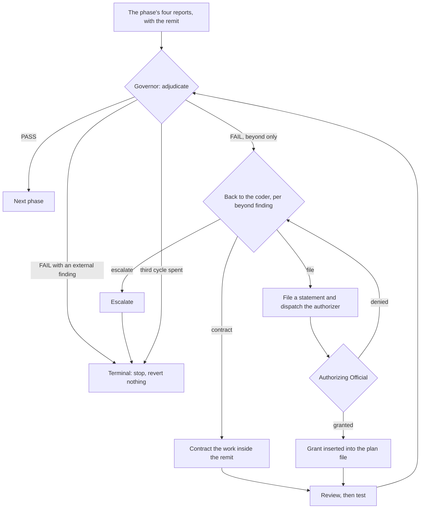
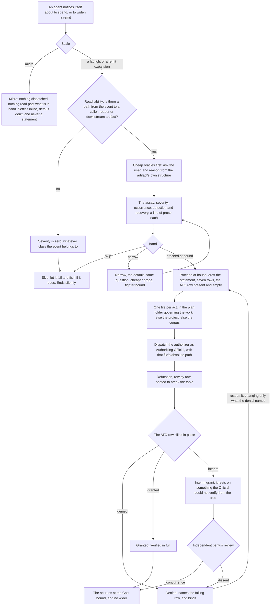

# Governance: what the work may not do

The [pipeline](pipeline.md) decides what the work is. The [chain](execution.md) does it. Governance decides what the work may not do, and it exists because an agent that can widen its own remit has no remit. It relies on the remit the plan files already state, a governor that holds each phase's reports to it, an assay any agent runs on itself the moment it notices itself about to spend, and an Authorizing Official who is the only party that can say yes.

The files that govern it are `skills/governing-work/SKILL.md`, `skills/performing-fmea/SKILL.md` with its two protocol files (`fmea-request.md` for the party weighing an act, `fmea-assessment.md` for the party deciding on it), the form they fill at `reference/templates/fmea-statement.md`, and the two role definitions `agents/governor.md` and `agents/authorizer.md`.

`※12` is the rule routing every act into it, on one principle: no party authorizes its own ultra vires work.

Governance is the heaviest layer here, and the reason is empirical: unauthorized work has been the costliest failure mode in practice, overruns running far past any charter before anything registered them.

## What counts as ultra vires

*Ultra vires* (*lit.* *beyond the powers*) is the public-law sense, and it turns on *charter*, the grant a piece of work runs under; [the lexicon](lexicon.md) carries both terms and `rules/ius.md` defines them. An act is ultra vires when it would put more work under that charter than the charter granted. The term describes the act rather than its merit, so a perfectly sensible act can be ultra vires.

It takes one of two shapes:

- **A launch**: a dispatch, or a sweep past what is already in hand, that the charter does not grant.
- **A remit expansion**: produced work beyond what the plan files or the dispatch prompt grant, ratified after the fact when the work could not be done without it.

A launch becomes ultra vires at the crossing, before it goes any further; produced work beyond the remit is caught at the phase boundary: `beyond` findings are contracted, ratified or escalated; an untasked change outside the repository ends the run there, by the dispatcher's call. Three things are not: narrowing, cutting an overrun back, and an action doctrine itself prescribes. The last of those reaches no wider than the provision claimed (`⊢4`). Obtaining the authorization is not delegation either (`⊢5`), so an agent at any depth of the chain can run this from where it stands.

## What settles below the protocol

Most defensive impulses never reach the protocol. The decision settles inline wherever nothing new is dispatched and nothing is read beyond what is already in hand: a guard, a fallback, a re-read, one more file. The default is don't. When the answer is do, one clause in the delivered response names the limb that fired, and that is the whole record.

Conceivable-only risk buys no defense at any severity, and in doubt the work proceeds undefended. Nothing at this scale earns a statement: a protocol that emits a table per guard has reproduced the disease it was built to cure.

## The remit is read where it lives

The remit is the Overview and the phase file as they stand, with every expansion ratified into them. Nothing is written a second time for the governor to test against, so no second text can drift from the first. A dispatched delegate's remit is its dispatch prompt, and a session's is its ask.

## The governor asks whether the work was necessary

The governor reads the Markdown it is handed and nothing else, at face value: its definition grants `tools: Read` alone, so it can run no command and dispatch nothing. Its question is whether everything a phase's reports record was necessary to accomplish the task its phase file and the Overview set. Work the task needed is within it however it was done; work the task did not need, work that adds to what the task delivers, however necessary, and anything documented as deferred are findings. A finding is `external` when it changed state outside the repository the task did not call for, and `beyond` otherwise. Review and testing own quality, correctness and test results.

The summary line is `PASS` or `FAIL`, and each finding is marked `beyond` or `external`. Whether to halt is the dispatcher's call: the orchestrator stops on a `FAIL` holding an `external` finding. `agents/governor.md` carries the exact wording.

## The remit check during phasing

In `phase`, after the plan files are written and before their review, the governor takes them alone and asks of each phase whether a later adjudication could tell from its phase file and the Overview whether the phase exceeded its task. The verdict is `PASS` or `FAIL`. A `FAIL` sends the analyzer back to repair the plan files from the source specs, still in the plan folder, and the check runs again; a third `FAIL` stops for the user (`⊨7`). The check never re-runs once it passes.

## A failed phase goes back to its coder

A `FAIL` returns the adjudication to the party that produced the work, which disposes of every `beyond` finding in one of three ways: contract the work back inside the remit; file one statement under `performing-fmea` and dispatch the authorizer itself, which is not delegation (`⊢5`); or escalate. A denial leaves that finding to contract or escalate. The dispositions are recorded under `## Remediation`, and the coder returns `REMEDIATED` or `ESCALATED` with its counts and statement paths.

A grant's amendment is inserted by the orchestrator into the plan file it amends, and then review, test and adjudication run again over the changed work. Three remediation dispatches per phase cap the cycle (`⊨7`), and a `FAIL` after the third dispatch ends the run.

```mermaid
flowchart TD
  REPORTS["The phase's four reports, with the remit"]
  GOV{"Governor: adjudicate"}
  NEXT["Next phase"]
  TERM["Terminal: stop, revert nothing"]
  CODER{"Back to the coder, per beyond finding"}
  CONTRACT["Contract the work inside the remit"]
  FILE["File a statement and dispatch the authorizer"]
  ESC["Escalate"]
  AUTH{"Authorizing Official"}
  GRANT["Grant inserted into the plan file"]
  RERUN["Review, then test"]

  REPORTS --> GOV
  GOV -->|"PASS"| NEXT
  GOV -->|"FAIL with an external finding"| TERM
  GOV -->|"FAIL, beyond only"| CODER
  CODER -->|"contract"| CONTRACT
  CODER -->|"file"| FILE
  CODER -->|"escalate"| ESC
  FILE --> AUTH
  AUTH -->|"granted"| GRANT
  AUTH -->|"denied"| CODER
  ESC --> TERM
  CONTRACT --> RERUN
  GRANT --> RERUN
  RERUN --> GOV
  GOV -->|"third cycle spent"| TERM
```

## The assay an agent runs on itself

Everything above governs work someone asked for. The other half of the apparatus governs work nobody asked for, and it fires the moment an agent notices itself deciding to spend, or to widen a remit.

The default is don't. The cost of the extra work is certain and immediate, while its benefit is discounted three times independently: the failure it guards against must occur, must escape detection, and must resist cheap repair. Those three discounts are the only thing that overrides the default.

Three preconditions come before any of it:

- **Reachability**: with no path from the event to a caller, dependent, reader or downstream artifact, severity is zero whatever class the event belongs to.
- **Retrospective triggers**: where the thing has already happened, what is assessed is the unresolved consequence rather than the class of the triggering event.
- **Cheap oracles**: ask the user, and reason from the artifact's own structure. A launch that has tried neither of those is not narrowed, merely large.

The limbs are a line of prose each, with no ordinal scales, no risk-priority number and no worksheet, because what is being governed is the decision to spend rather than the shape of the output. Severity is calibrated by contrast: an irreversible act against a stack trace. Occurrence is graded observed, boundary-adjacent or conceivable-only, and conceivable-only clears the bar at no severity; an observed grade carries an independently checkable citation or it downgrades. Detection starts from the assumption that the environment detects well, which is why most candidate defenses turn out to target failures that would have been loud and one edit from fixed.

Three bands close it: proceed, narrow and skip. `fmea-request.md` states the predicate that chooses between them, and states it in that one place. Narrow is the default and launches nothing; the narrowed work either falls to micro scale and settles inline or returns as a proceed. Skip ends the matter silently. Only a proceed-at-bound is dispatched for authorization.

## The statement of assumed risk

A proceed is written into a file of its own, one per act, so that concurrent delegates never append to the same one. It lands in the first home that applies: the plan folder governing the work, the project being worked in, or the corpus itself.

Its shape is the template at `reference/templates/fmea-statement.md`: the question the act would answer, the limbs the assay graded, the Cost bound, the band the verdict chose, and an authorization row carried into dispatch present and empty. Verdict and ATO are different rows with different authors, and neither is ever written into the other.

Cost is a bound rather than an estimate, and the distinction is practical: delegated spend is not predictable within a factor of two, and the dispatching session does not control what a delegate does. So the row is written to be enforceable in the dispatch prompt, or recorded in the plan file the next adjudication reads, and checkable afterwards either way. It is also how narrowing is executed, since narrowing is mostly a matter of choosing a tighter bound rather than a different question.

An expansion's Cost row is the amendment to the remit, ready to insert as is, each added line carrying the statement's citation.

## What the Authorizing Official decides

The authorizer assesses the file at the path it is handed, and nothing else: not a copy of the table pasted into a prompt, and never the act itself. The dispatching session may not authorize itself. `agents/authorizer.md` is the role and `fmea-assessment.md` is the standard it works to.

That standard is refutation, row by row, briefed to break the table: whether the question terminates the act when answered, whether an observed grade rests on a citation someone else could check or on prose and code comments, whether being wrong would really stay silent in an environment holding tests, type checkers, linters and a reader on the diff, and whether a cheaper probe answers the same question. Naming that cheaper disconfirmation, where one exists, is usually worth more than the decision itself.

What is final is the Official rather than the matter: a denial names the failing row and binds, no appeal reaches a second Official, and the requesting agent either narrows and resubmits or drops the act. Disagreement escalates to the user, never past the Official. A grant resting on anything the Official could not verify from the tree issues as interim and goes to a peritus for independent review, and that peritus's judgment is adopted.

The response is the authorization row filled in place, and nothing else: no second document, no report file, no restated table. A grant authorizes the act at the Cost bound its row names and nothing wider, so crossing that bound is not overrun but operating unauthorized, and it takes a fresh statement. A denial is recorded exactly as a grant is, because the denials are what the record exists to measure.

Above all of it sits the user, with a standing veto over any grant.

```mermaid
flowchart TD
  SPEND["An agent notices itself about to spend, or to widen a remit"]
  SCALE{"Scale"}
  MICRO["Micro: nothing dispatched, nothing read past what is in hand. Settles inline, default don't, and never a statement"]
  REACH{"Reachability: is there a path from the event to a caller, reader or downstream artifact?"}
  ZERO["Severity is zero, whatever class the event belongs to"]
  ORACLE["Cheap oracles first: ask the user, and reason from the artifact's own structure"]
  ASSAY["The assay: severity, occurrence, detection and recovery, a line of prose each"]
  BAND{"Band"}
  SKIP["Skip: let it fail and fix it if it does. Ends silently"]
  NARROW["Narrow, the default: same question, cheaper probe, tighter bound"]
  DRAFT["Proceed at bound: draft the statement, seven rows, the ATO row present and empty"]
  FILE["One file per act, in the plan folder governing the work, else the project, else the corpus"]
  AO["Dispatch the authorizer as Authorizing Official, with that file's absolute path"]
  REFUTE["Refutation, row by row, briefed to break the table"]
  DECIDE{"The ATO row, filled in place"}
  DENY["Denied: names the failing row, and binds"]
  FULL["Granted, verified in full"]
  INTERIM["Interim grant: it rests on something the Official could not verify from the tree"]
  PERITUS{"Independent peritus review"}
  ACT["The act runs at the Cost bound, and no wider"]

  SPEND --> SCALE
  SCALE -->|"micro"| MICRO
  SCALE -->|"a launch, or a remit expansion"| REACH
  REACH -->|"no"| ZERO
  ZERO --> SKIP
  REACH -->|"yes"| ORACLE
  ORACLE --> ASSAY
  ASSAY --> BAND
  BAND -->|"skip"| SKIP
  BAND -->|"narrow"| NARROW
  NARROW --> ASSAY
  BAND -->|"proceed at bound"| DRAFT
  DRAFT --> FILE
  FILE --> AO
  AO --> REFUTE
  REFUTE --> DECIDE
  DECIDE -->|"denied"| DENY
  DECIDE -->|"granted"| FULL
  DECIDE -->|"interim"| INTERIM
  FULL --> ACT
  INTERIM --> PERITUS
  PERITUS -->|"concurrence"| ACT
  PERITUS -->|"dissent"| DENY
  DENY -->|"resubmit, changing only what the denial names"| DRAFT
```

## Related pages

- [Execution](execution.md): the chain whose produced work the adjudication holds to the remit.
- [The pipeline](pipeline.md): how the plan files that state the remit are produced, and where the remit check runs.
