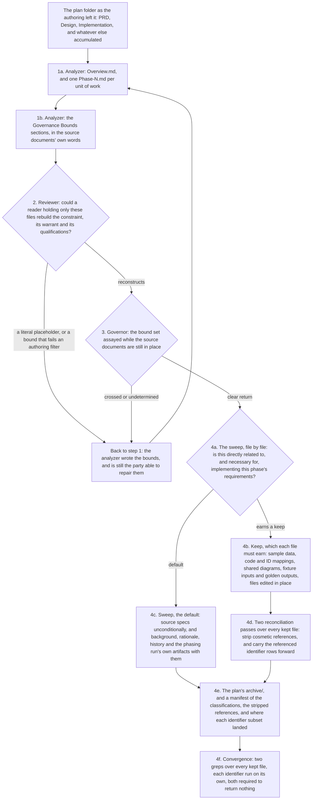
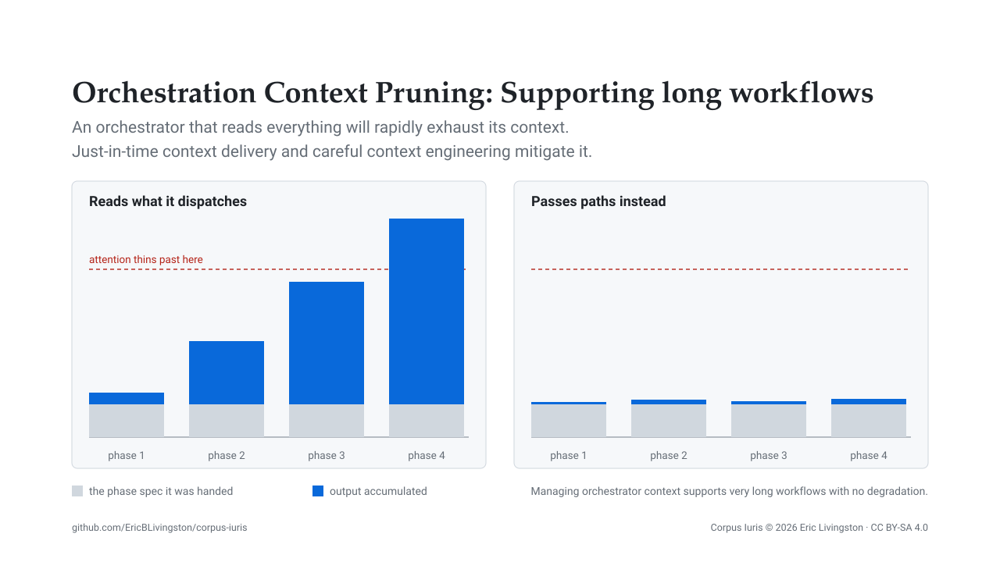

# Pipeline: from a request to phased work

Spec-Driven Development is one of the three layers published here. It is the part that turns a request into documents, and those documents into a folder of phases something else can execute. The commands are ordinary Markdown: each one states what it takes, which template it fills, which agent it dispatches, and what it hands on.

## The commands, and what each produces

`prepare`, `phase`, `orchestrate`, `debrief` and `finalize` are the staged line. `implement` is the unphased alternative to `orchestrate`, for a plan small enough to run as one unit. `optimize` sits off the line entirely, as a pass over a single document.

| Command | Takes | Produces | Hands on | Changes code |
| ---- | ---- | ---- | ---- | ---- |
| `prepare` | the target artifact's path | `PRD.md`, `Design.md` or `Implementation.md`, plus `Background.md` on the PRD branch | the next artifact, named by the PRD's own next-step section | no |
| `phase` | the plan folder | `Overview.md`, one or more `Phase-N.md`, and a sweep manifest under `archive/` | a folder `orchestrate` can consume, bounds already assayed | no |
| `orchestrate` | the plan folder, optionally a phase to start from | per-phase analysis, implementation, review, test and adjudication reports, then `Implementation-Debrief.md` | the debrief, to `finalize` | yes, through the coder agent |
| `implement` | one plan file, or a plan already in conversation | an implementation report beside the plan | nothing staged; it is the whole run | yes, through the coder agent |
| `debrief` | the plan folder, every phase complete | `Implementation-Debrief.md` | the debrief, to `finalize` | no |
| `finalize` | the plan folder holding that debrief | `debrief/Debrief.md` and `debrief/Implementation.md` | a close-out plan the user reviews, then re-phases | no |
| `optimize` | one document path | an `-OPT` copy under `.analysis/`, never beside the original | nothing; a standalone pass | no |

Only `orchestrate` and `implement` reach code, and neither writes any itself: both route every edit through the coder agent.

## The line closes into a loop

`finalize` states its own position as `orchestrate → finalize → (manual review) → phase → orchestrate`, and it stops at the review. The close-out plan it produces is a plan like any other, so the user reads it, then re-enters the pipeline at `phase`. Nothing continues automatically, because the decision the loop turns on is which of the debrief's items are worth doing at all.

## `prepare`: the artifact you name is the artifact it writes

The argument is a path, for example `plans/<name>/Design.md`. Two facts are read off it: the directory is the plan folder, and the filename selects the branch.

| Target | Template filled | Precursors read | Next step |
| ---- | ---- | ---- | ---- |
| `PRD.md` | the PRD template | the user's request | routed to Design or Implementation, and the routing is recorded in the PRD |
| `Design.md` | the Design template | the sibling `PRD.md` | always Implementation |
| `Implementation.md` | the Implementation template | the sibling `PRD.md`, plus `Design.md` where one exists | terminal: `implement` or `orchestrate` |

`Background.md` is the ground: why there is a plan at all. It exists for a mechanical reason: the agent that authors the artifact does not inherit the session where the request was made, so whatever the session knows and the plan folder does not has to be written down before the dispatch.

The three artifacts are three regimes, and the test for which one owns a fact is which change would rewrite it:

- The PRD is Why, and a different problem rewrites it.
- The Design is What, and a different conceptual approach rewrites it.
- The Implementation is How, and a different technology stack rewrites it.

A regime above the rewritten one stands, which is what makes a late change cheap: it lands in one document instead of in every document downstream of it. Each regime keeps its own deliberation and passes on only its result, because justification is a context sink.

Which of the two lower regimes a PRD routes into is decided by the exploring agent from what it observed in the codebase rather than from the request. Work that fits the established architecture, patterns and boundaries with no new components or data shapes routes straight to Implementation; requirements introducing something the codebase does not yet accommodate route to Design. In doubt it prefers Design, on the ground that an unneeded design document is cheap and starting implementation against an unsettled architecture is not.

## `phase`: from specs to a folder that executes

Four steps produce a folder shaped for execution rather than for reading. The first three are delegated to the analyzer, the reviewer and the governor in turn; the sweep that closes the run names no delegate.

The analyzer writes `Overview.md` and one `Phase-N.md` per unit of work (1a). The Overview carries the orchestration and everything more than one phase needs; each phase file carries that phase's own actionable tasks and nothing redundant with the Overview, since both are handed to every phase.

It then fills the `## Governance Bounds` section of the Overview and of each phase file (1b), from the limits the plan's own source documents place on the work, in those documents' words. Those limits are already written before phasing begins, as non-goals, guardrails, rejected options, risk mitigations and out-of-scope items. [The governance page](governance.md) covers where each one comes from and what makes one testable.

The reviewer then compares the produced files against the source specs (2), and the standard is reconstruction rather than mention: could a reader holding only these files rebuild the constraint, its warrant and its qualifications? A file still carrying a literal placeholder is rejected, and so is a bound that fails one of the authoring filters.

The bound set is then assayed by the governor before anything is archived (3). That gate is specified by `orchestrate`, and it runs here instead because the source documents are still in place and the analyzer that wrote the bounds is still the party able to repair them. A clear return means `orchestrate` confirms the gate later rather than discovering it.

The sweep runs last, on that clear return. Every file in the folder that is not `Overview.md` or `Phase-N.md` is classified against one question (4a): is this content directly related to, and necessary for, implementing this phase's requirements? The default is to sweep (4c), and each file must earn a keep (4b). Source specs sweep unconditionally, however substantial they are, because keeping one pulls the plan into context twice; background, rationale, history and the process artifacts of the phasing run itself go with them. A keep is reserved for secondary reference material: sample data, code and ID mappings, diagrams shared across phases, fixture inputs and golden outputs, files being edited in place.

Two reconciliation passes run over every kept file before anything moves (4d). The first strips cosmetic references to swept files and flags any surviving substantive one, because a reference reaching past the seam is rationale leaking back in. The second extracts every identifier a swept file defines (e.g. table-row IDs, finding codes, glossary terms) and carries the referenced rows forward: rows two or more phases reference land in the Overview, rows exactly one phase references land in that phase file, and only the rows actually referenced carry. A bare code whose defining table did not come with it is a defect.

The swept files then move to the plan's `archive/`, and a manifest records the per-file classification, the stripped references, and the identifier set with where each subset landed (4e). Convergence is two greps over every kept file, both required to return nothing (4f): any path under `archive/`, and each manifest identifier run on its own rather than as one union, so a missed inlining is attributable to a single identifier.

## `orchestrate`: driving the folder end to end

The plan folder's absolute path is resolved before anything else, by running `pwd` and prepending it, because sub-agents may run with a different working directory and a relative path silently lands outside the project.

The run then proceeds through gates, in order:

1. A clean working tree and a captured baseline commit every reviewer pass will diff against.
2. A plan folder with an Overview, phase files discovered and sorted, and no gap in the numbering.
3. The boundary validation the phasing run already cleared.
4. The production chain over each phase in turn, covered in [the execution page](execution.md).
5. A debrief.
6. A fact-check of the sub-agents' own reports against the session record, which is an honesty check rather than a quality gate and does not halt the run.

Every gate shares one failure mode, called **the Terminal**. It stops, leaves the tree exactly as it is, reverting nothing and committing nothing and deleting nothing, reports the phase and step reached and the gate that failed, and hands control back. No branch continues past a gate it did not clear.

## `implement`: the unphased alternative

`implement` takes a single plan file, or a plan already in the conversation, in which case it asks for the destination folder and confirms it before proceeding. Execution is the same production chain, with four additions:

- The coder records deviations in the plan file before review.
- The reviewer checks that they were recorded and that acceptance criteria carry verifier hints.
- The tester's verification includes the cross-boundary end-to-end gate wherever the work crosses a boundary.
- Where the plan carries a bounds section, the governance gate runs over the produced work.

A deviation is a departure the plan did not anticipate, and the plan file records it. A departure that would cross a bound is not a deviation: it is ultra vires, and the authorization comes before the edit.

## `debrief` and `finalize`: closing what the run left open

`debrief` sweeps the whole plan folder unconditionally. The debrief is the only artifact that records an assessment, so nothing else marks a phase as already assessed: not a commit, not a green test report, not a passing review. It reads every Markdown file in the folder root and none of the archived specs, extracts what the run left open into the categories its template defines, and ranks each item by severity.

`finalize` converts that into a plan, under two rules. The first rule is the binary decision: every carried item takes a Yes or a No, with no third option, and a No is a closure carrying its rationale, on the reasoning that if the item still matters a future analyzer rediscovers it from the live codebase, and if it is never rediscovered it was not material. The Yes list becomes an implementation plan grouped by work class, each item carrying its original finding ID, its file path and a verifier hint.

The second rule is immutability, and it binds the produced plan's contents as much as its file operations. Everything in the plan folder outside `debrief/` is a historic record, errors and stale claims included, because forensic work later depends on those files reading exactly as the implementation left them. A defect spotted in an upstream artifact therefore goes on the No list with that rationale, rather than becoming a Yes-list item that would edit it: the same prohibited modification, deferred by one hop, is still prohibited.

A grep over the produced plan then checks for the vocabulary of deferral, and the command discloses what that check is: a net that catches the recurring wordings and reaches no novel one, so a clean pass is evidence of a binary draft rather than proof of one.

## `optimize`: a pass over one document

The analyzer applies a fixed set of cuts (redundancy, verbosity, tutelage, tautology, superfluity, obsolescence, vacuity and scaffolding), and a ninth optimization refactors for maximum understanding at minimum tokens. The reviewer then compares the copy against the original for comprehensiveness, sufficiency and accuracy. Two kinds of duplicate are legitimate and stay: an enumeration that names the provision it enforces, and a passage carrying a reason or an operational detail the source lacks.

The copy lands under `.analysis/`, the staging area the command names, rather than beside the original, because an optimized copy in an always-loaded directory is loaded alongside the file it optimized and doubles the cost the pass was run to cut.

## Why an executing phase is handed so little

`commands/orchestrate.md` opens with the constraint, which reads in full:

> You orchestrate; you do not investigate. **NEVER** read source, or any file a sub-agent in this run wrote; **NEVER** write, edit, review, or test code yourself — a granted replacement into this plan's bounds is yours to record. Read only `Overview.md` and the `Phase-X.md` files — the whole specification this run executes against — plus `{command-root}/{implement,debrief}.md` and the dispatch prompts under `{reference-root}/templates/orchestration/` once each; a skill this workflow directs you to invoke is not a read. The specs those phase files superseded are archived and closed to you and to every implementing specialist; the Validate Boundaries gate alone is handed them, for provenance. **DO** pass file paths between sub-agents and instruct each to write detailed output to files and return only a one-line status. If something fails, dispatch a specialist — don't investigate yourself.

The archived specs therefore reach exactly one reader in the whole run: the boundary-validation gate, which needs the source documents to decide whether a bound's provenance is what it claims. That single exception is what makes the archive drop a design rather than a prohibition.

The reason for the cut is that the adjacent phase is close to the worst possible distractor. Irrelevant material competes for attention rather than sitting inertly beside the signal, and the damage scales with resemblance: same project, same vocabulary, same file paths, adjacent intent, no longer relevant. Length alone degrades performance too, so dropping even harmless material pays. [The references](references.md) carry the work behind both claims.

Pruning at the outset is only half of the remedy, because an orchestrator that reads what it dispatches re-accumulates everything the split was meant to prevent. The orchestrating session therefore never reads source, and never reads any file a sub-agent in the run wrote: not the analysis, not the implementation report, not the review, not the test report, not the audit. The discipline holds because the specialists return one line each and write their detail to files, rather than because the orchestrator exercises restraint over content it is holding.

It does write three things into the plan folder, and all three are records of a gate rather than work product:

- A failed boundary gate's return, verbatim.
- A non-clear adjudication's return, verbatim, with the bounds it was dispatched against.
- The granted text of a bound amendment, over the bound it replaces, with the grant recorded beneath.

## Related pages

- [Execution](execution.md): the chain of specialists that executes what this pipeline produces.
- [Governance](governance.md): where a bound comes from, and what it costs to move one.
- [The references](references.md): the published work behind the attention and length claims this page rests on.
