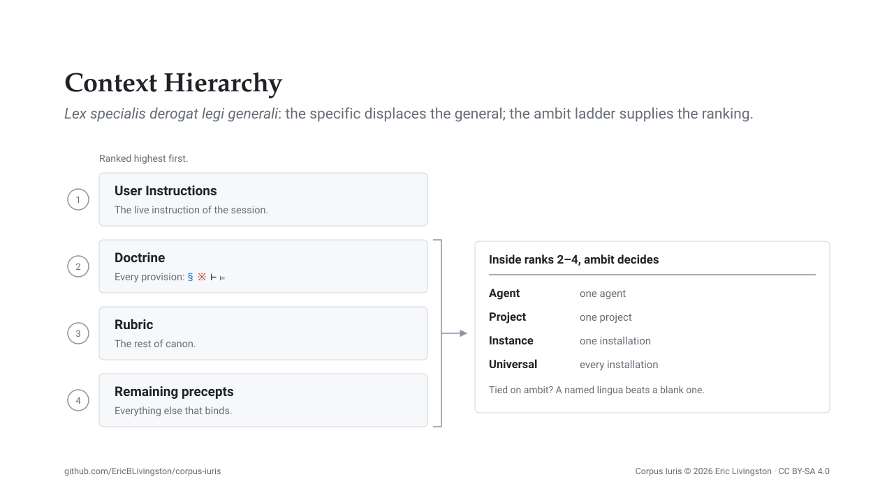

# Structure: how a precept is addressed, and how a collision resolves

The [lexicon](lexicon.md) fixes the vocabulary. This page sets out what is built from it: the four instruments a precept may be minted under, the four positions of the token that addresses it, the ladder of reach those tokens sit on, the categories a precedence rank ranges over, and the rule that settles a collision between two of them. `rules/ius.md` states all of this for the corpus itself; what follows explains the mechanism rather than restating it.

## The four instruments

A precept that binds is minted under one of four instruments, and the prefix symbol marks which:

- `§` **directives** govern what you produce.
- `※` **rules** govern how you work.
- `⊢` **interpretive rulings** reconcile a priori conflicts and silences among precepts already in hand.
- `⊨` **empirical resolutions** hold the same office a posteriori, for a collision that surfaced only in application.

The distinction between the two turnstiles is the one they carry in logic: a `⊢` can be argued from the provisions as written, whereas a `⊨` required a failure to occur first. Canon's remainder is rubric, which instructs or prescribes procedure without minting a citable clause; uncontested, it carries the same authority as a provision. Provisions are minted principally so that a collision has something to name and a citation has something to resolve to.

## The four positions of a token

A token comprises four positions: the instrument symbol, the ambit, the lingua, and the number. Instrument and number are always present; the remaining two are meaningful when blank, which is what keeps the common case short.

A blank ambit denotes the universal, so `§5` binds every installation. A blank lingua denotes all content whatever its syntax, so `§5` binds Markdown, Python and prose alike, while `§md2` binds Markdown alone. `§I7` binds one installation across every language; `§Ipy4` binds one installation's Python; `※A3` is one agent's rule governing its own conduct. A lingua proxies a language by membership rather than by extension string, so the `cc` lingua reaches `.cc`, `.cpp` and `.h` without enumerating them.

The number is 1-based within its own namespace, and namespaces do not collide across ambits. That is what makes the `I`, `P` and `A` ambits safe to mint in: `§Ipy4` is yours, `§py4` is ours, and neither has to know about the other.

## The ambit ladder

Ambit is reach, and it has four rungs, each naming what a provision at that rung reaches:

- **Universal** is every installation of the corpus.
- **Instance** is one installation.
- **Project** is one project.
- **Agent** is one agent's own conduct.

Instance sits above universal because it exists to override it, and below project and agent so that a single project or agent may still deviate from an installation-wide decision. An instance provision takes one of two forms. A **keyed** provision is headed by an existing universal token and overlays it for this installation, retaining the number so the citation still resolves. A **minted** provision is a fresh token in the `I` ambit, numbered from 1, for something the universal ambit does not supply at all.

Overlay is the consequential half. A keyed entry replaces what conflicts, passes through what does not, and fills silence, so it scales from the narrowest qualification to a wholesale rewrite without changing form. Deleting the row restores the base.

## The categories the ranks range over

Precedence is stated in categories rather than in file names, so the sorting settles first: what is corpus at all, what of that is canon, and how doctrine and rubric divide canon between them. [The lexicon](lexicon.md) carries each term and the grounds it was selected on.

## Precedence, and the rule of *lex specialis*

Four ranks decide which precept governs a point of conflict: the user's live instruction first, then doctrine, then rubric, then everything else that binds. Standing instruction, once written down, is precept and takes its precept rank rather than the first one.

Within the lower three ranks the more specific governs, and specificity is read off the token: ambit first, along the ladder above, and within one ambit a named lingua defeats a blank one. Where there is no instrument at all, location determines the ambit, which is why a rules file's own directory is part of its meaning.

Adventitia is rubric arriving from outside: system prompts, built-in tool descriptions, plugin and MCP-server instructions. It binds as any other rubric binds, and it yields to any authored precept it collides with. That is a ruling in the corpus (`⊢3`) rather than a preference, and the register of collisions observed on a given installation resides in that installation's own instance file.

## Renumbering, and what an adopter should do instead

A global token is worth having only if it denotes the same provision in your corpus and in ours, since that is what permits a provision to be cited in a document traveling between them. Renumber to close a gap and your `※5` ceases to be our `※5`.

The failure is silent because the resolution still succeeds. A citation is resolved by literal token match: the model matches `※5` against its earlier occurrences in context and attends to what followed them ([the references](references.md)). Renumber, and the model still reaches a defining site: a different provision, presented exactly as the right one would be. Retire a provision instead and the citation has no defining site anywhere, which a reader or a reference check can see; change what the number denotes and neither has anything to look at.

That is the whole argument behind the recommendations in [`adopting.md`](../adopting.md): key over in your instance file wherever the provision still has a subject on your installation, leave the gap where it has none, and mint fresh in an ambit that is yours alone. [The release scheme](../README.md) states which revisions oblige you to re-read.

## Related pages

- [The lexicon](lexicon.md): the terms these instruments and ambits are built from, and why each was selected.
- [The references](references.md): the published work behind the retrieval mechanism a citation depends on.
